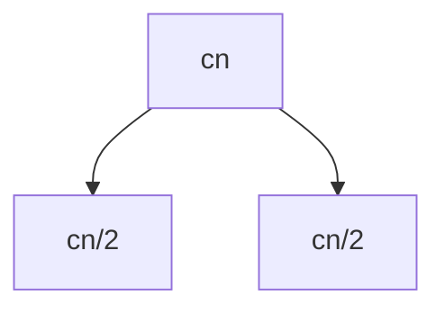
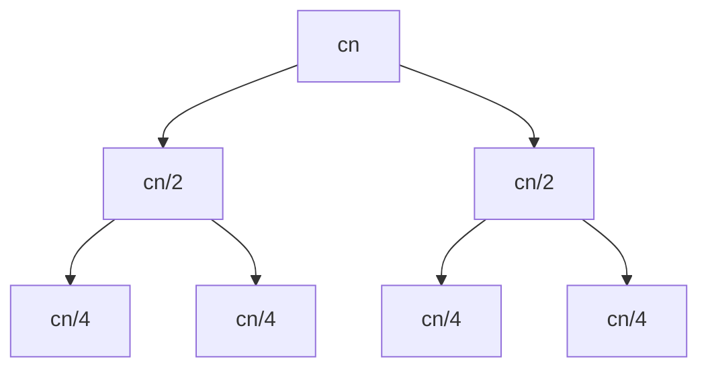
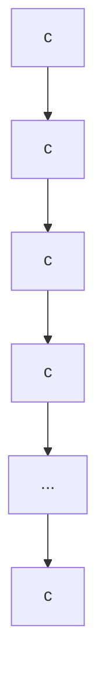
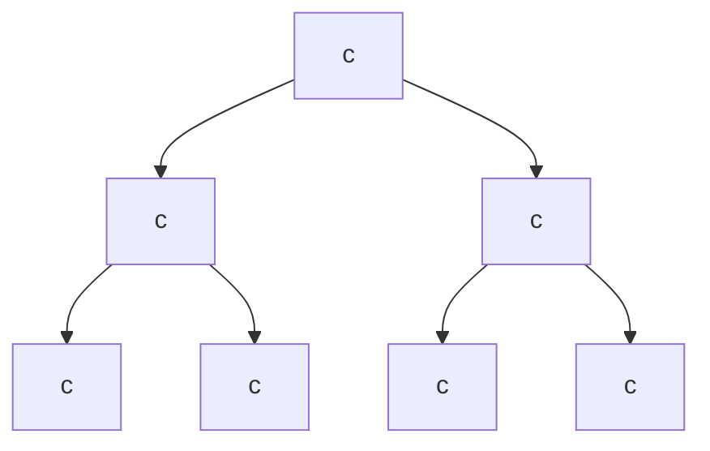
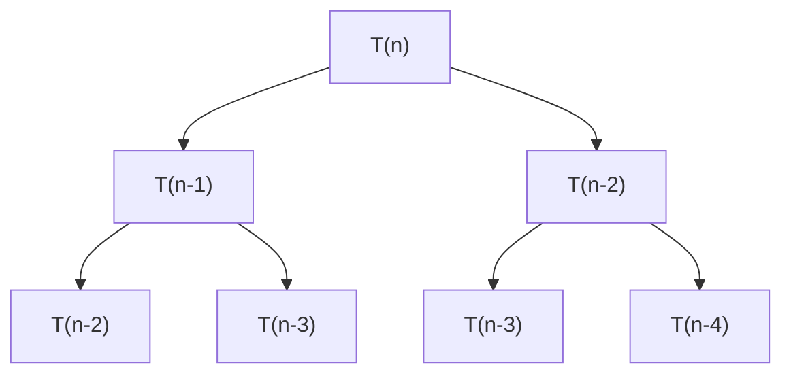

# Recursion Tree Method

The **Recursion Tree Method** is a technique used to analyze the time complexity of recursive algorithms by representing recursive calls as a tree.

Each node represents the cost of a recursive call, and the total cost of the algorithm can be determined by calculating the cost at each level of the tree.

---

## 1. What is the Recursion Tree Method?

A recursion tree represents the recursive structure of an algorithm.

The general process is:

1. Write the recurrence relation.
2. Represent the recurrence as a tree.
3. Calculate the cost at each level.
4. Determine the number of levels in the tree.
5. Add the cost of all levels.
6. Simplify the resulting expression using asymptotic notation.

For example, consider:

\[
T(n) = 2T(n/2) + cn
\]

where:

- `2T(n/2)` represents two recursive calls.
- `cn` represents the non-recursive work performed at each call.
- `c` is a constant.

---

# 2. Example 1: T(n) = 2T(n/2) + cn

Consider the recurrence:

\[
T(n) = 2T(n/2) + cn
\]

with the base case:

\[
T(1) = c
\]

### Step 1: Build the recursion tree

The root performs `cn` work and creates two recursive calls.



At the next level, each `T(n/2)` call creates two `T(n/4)` calls.



---

## Step 2: Cost at Each Level

### Level 0

There is one node:

\[
cn
\]

Total cost:

\[
cn
\]

### Level 1

There are two nodes.

Each node performs:

\[
cn/2
\]

Therefore:

\[
2 \times cn/2 = cn
\]

Total cost:

\[
cn
\]

### Level 2

There are four nodes.

Each node performs:

\[
cn/4
\]

Therefore:

\[
4 \times cn/4 = cn
\]

Total cost:

\[
cn
\]

The same pattern continues.

| Level | Number of Nodes | Cost per Node | Total Cost |
| ----: | --------------: | ------------: | ---------: |
|     0 |               1 |          `cn` |       `cn` |
|     1 |               2 |        `cn/2` |       `cn` |
|     2 |               4 |        `cn/4` |       `cn` |
|     3 |               8 |        `cn/8` |       `cn` |
|   ... |             ... |           ... |        ... |
| log₂n |               n |           `c` |       `cn` |

Therefore, the cost at every level is:

\[
cn
\]

---

## Step 3: Number of Levels

At every level, the input size is divided by `2`.

Therefore:

\[
n,\frac{n}{2},\frac{n}{4},\frac{n}{8},\ldots,1
\]

The number of levels is:

\[
\log_2 n
\]

---

## Step 4: Total Cost

Each level costs:

\[
cn
\]

and there are:

\[
\log_2 n
\]

levels.

Therefore:

\[
T(n) = cn\log_2 n
\]

Ignoring constants:

\[
\boxed{T(n) = \Theta(n\log n)}
\]

### Result

```text
T(n) = 2T(n/2) + cn

Time Complexity = Θ(n log n)
```

---

# 3. Example 2: T(n) = T(n/2) + c

Consider:

\[
T(n) = T(n/2) + c
\]

with:

\[
T(1) = c
\]

This recurrence contains only **one recursive call**.

---

## Recursion Tree



The input size is repeatedly divided by `2`:

\[
n,\frac{n}{2},\frac{n}{4},\frac{n}{8},\ldots,1
\]

---

## Cost at Each Level

Every level performs constant work:

\[
c
\]

Therefore:

| Level | Cost |
| ----: | ---: |
|     0 |  `c` |
|     1 |  `c` |
|     2 |  `c` |
|     3 |  `c` |
|   ... |  ... |
| log₂n |  `c` |

Number of levels:

\[
\log_2 n
\]

Total cost:

\[
c\log_2 n
\]

Ignoring the constant:

\[
\boxed{T(n) = \Theta(\log n)}
\]

### Result

```text
T(n) = T(n/2) + c

Time Complexity = Θ(log n)
```

---

# 4. Example 3: T(n) = 2T(n/2) + c

Consider:

\[
T(n) = 2T(n/2) + c
\]

with:

\[
T(1) = c
\]

---

## Recursion Tree



At every level, the number of nodes doubles.

---

## Cost at Each Level

### Level 0

\[
c
\]

### Level 1

\[
2c
\]

### Level 2

\[
4c
\]

### Level 3

\[
8c
\]

Therefore:

\[
c + 2c + 4c + 8c + \ldots
\]

The number of nodes at level `i` is:

\[
2^i
\]

Therefore, the cost at level `i` is:

\[
c2^i
\]

---

## Number of Levels

The input size is divided by `2` at every level.

Therefore:

\[
\log_2 n
\]

levels are required.

At the final level, the number of nodes is approximately:

\[
n
\]

Therefore, the total cost is dominated by the final level:

\[
\Theta(n)
\]

### Result

\[
\boxed{T(n) = \Theta(n)}
\]

---

# 5. Example 4: T(n) = T(n-1) + c

Consider:

\[
T(n) = T(n-1) + c
\]

with:

\[
T(1) = c
\]

This recurrence decreases the input by `1` at every recursive call.

---

## Recursion Tree

Because there is only one recursive call, the tree becomes a chain.


The input sizes are:

\[
n,n-1,n-2,n-3,\ldots,1
\]

There are approximately `n` levels.

---

## Total Cost

Each level performs constant work:

\[
c
\]

Therefore:

\[
c+c+c+\ldots+c
\]

for approximately `n` levels.

Thus:

\[
T(n)=cn
\]

Ignoring the constant:

\[
\boxed{T(n)=\Theta(n)}
\]

---

# 6. Example 5: T(n) = T(n-1) + T(n-2) + c

Consider the recurrence:

\[
T(n) = T(n-1) + T(n-2) + c
\]

This produces a branching recursion tree.



The number of recursive calls grows rapidly as `n` increases.

This type of recurrence is closely related to the Fibonacci sequence.

A simple recursive Fibonacci implementation has exponential time complexity.

For the naive recursive implementation:

\[
T(n)=T(n-1)+T(n-2)+O(1)
\]

The resulting time complexity is:

\[
\boxed{O(2^n)}
\]

A tighter bound can be expressed using the Fibonacci growth rate, but `O(2^n)` is commonly used as a simple upper bound.

---

# 7. Upper Bound Using the Recursion Tree Method

The recursion tree can also be used to determine an **upper bound** on the running time.

Suppose:

\[
T(n)=2T(n/2)+cn
\]

At each level, the total non-recursive cost is:

\[
cn
\]

The number of levels is:

\[
\log_2 n
\]

Therefore:

\[
T(n)=cn\log_2 n + O(n)
\]

Thus:

\[
\boxed{T(n)=O(n\log n)}
\]

In fact, this recurrence has a tight bound:

\[
\boxed{T(n)=\Theta(n\log n)}
\]

---

# 8. General Pattern

For a recurrence of the form:

\[
T(n)=aT(n/b)+f(n)
\]

the recursion tree can be analyzed using three important quantities:

### Number of nodes at level `i`

\[
a^i
\]

### Input size at level `i`

\[
\frac{n}{b^i}
\]

### Total work at level `i`

This depends on the non-recursive work:

\[
a^i f\left(\frac{n}{b^i}\right)
\]

The total running time is obtained by summing the work across all levels.

---

# 9. Steps to Solve a Recurrence Using a Recursion Tree

Use the following procedure:

1. Write the recurrence relation.
2. Identify the number of recursive calls.
3. Identify how the input size changes.
4. Draw the first few levels of the recursion tree.
5. Calculate the cost at each level.
6. Identify the number of levels.
7. Calculate the cost of the leaf level if necessary.
8. Sum the costs of all levels.
9. Simplify the final expression.
10. Express the result using asymptotic notation.

---

# 10. Key Takeaways

- A recursion tree represents recursive calls as a tree.
- Each node represents the work performed by a recursive call.
- The cost of every level should be calculated separately.
- The number of levels depends on how the input size changes.
- For `T(n) = 2T(n/2) + cn`, every level costs `cn`.
- For `T(n) = T(n/2) + c`, the number of levels is `log₂ n`.
- For `T(n) = T(n-1) + c`, there are approximately `n` levels.
- Recursion trees are useful for understanding and solving recurrence relations.
- Recursion trees can provide asymptotic upper bounds as well as tight bounds when the analysis is sufficiently precise.

---

## Summary Table

| Recurrence                   | Recursion Pattern                   | Time Complexity |
| ---------------------------- | ----------------------------------- | --------------- |
| `T(n) = T(n/2) + c`          | One branch, input halved            | `Θ(log n)`      |
| `T(n) = 2T(n/2) + c`         | Two branches, input halved          | `Θ(n)`          |
| `T(n) = 2T(n/2) + cn`        | Two branches, linear work per level | `Θ(n log n)`    |
| `T(n) = T(n-1) + c`          | One branch, input reduced by 1      | `Θ(n)`          |
| `T(n) = T(n-1) + T(n-2) + c` | Fibonacci-like branching            | `O(2^n)`        |

---
